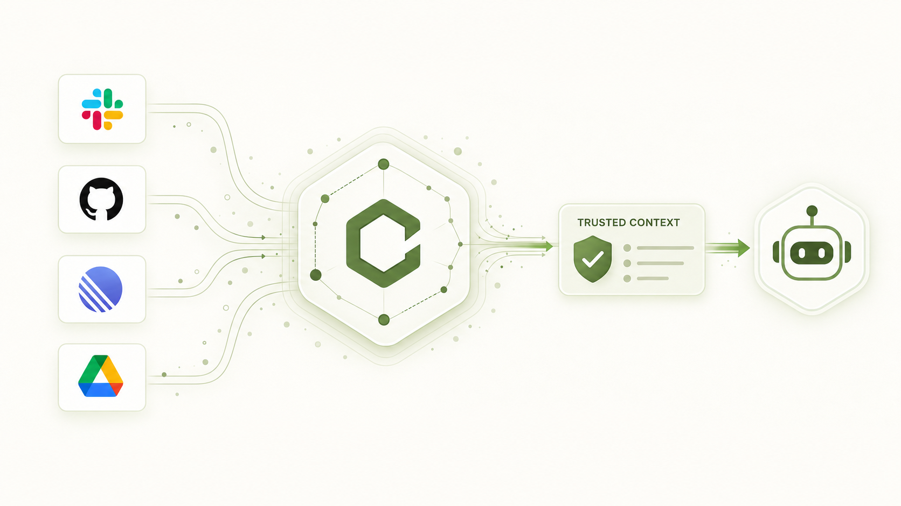
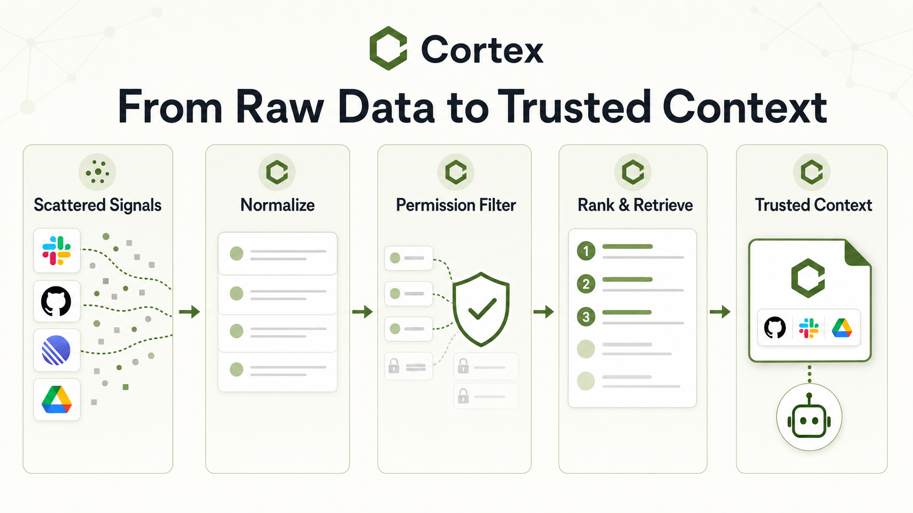
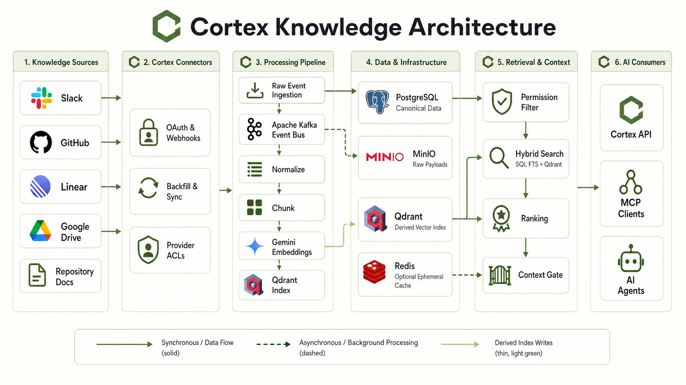
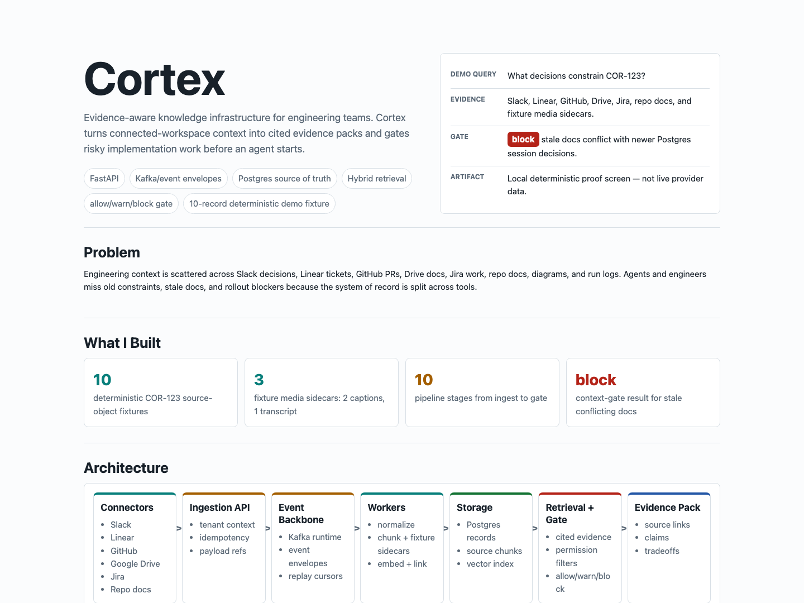
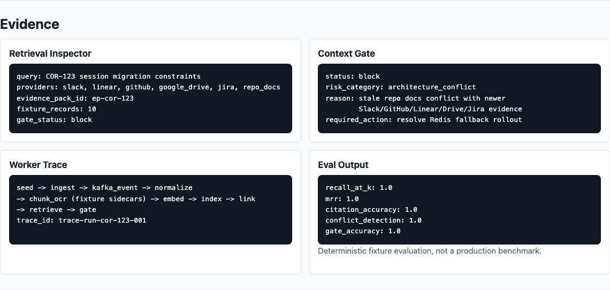

<div align="center">

# Cortex

### Trusted decision context for AI engineering teams

[](docs/current-state.md)
[](pyproject.toml)
[](src/cortex/api/app.py)
[](src/cortex/mcp/server.py)

**Cortex connects approved engineering knowledge sources, returns cited task context, and helps agents stop when the evidence is stale, conflicted, missing, or unsafe.**

[Architecture](#how-cortex-works) · [Quick start](#quick-start) · [Demo](#fixture-demo) · [Connectors](#beta-connectors) · [Docs](#documentation)



</div>

> **Current status — invite-only beta.** The product visuals in this README illustrate Cortex's intended experience and target architecture. The repeatable public demo uses a deterministic, synthetic fixture corpus; it does **not** demonstrate live customer data, live provider authentication, or production retrieval quality.

---

## The context gap

AI coding agents move quickly, but engineering context lives across Slack threads, issues, pull requests, repository docs, and prior decisions. When the right context is absent—or worse, stale and conflicting—teams get confidently wrong implementations, duplicated investigation, and decisions that disappear between sessions.

Cortex is built for the moment before implementation: **what prior decisions constrain this task, what evidence supports them, and is it safe for an agent to proceed?**

| Without Cortex | With Cortex |
| --- | --- |
| Agents search scattered sources or rely on stale memory files | Agents receive compact, task-specific context with citations |
| Important decisions stay buried in chat threads and PRs | Decisions can be surfaced, reviewed, and preserved as canonical memory |
| Missing or conflicting evidence is easy to overlook | A context gate can return `allow`, `warn`, or `block` with reasons |
| Retrieval ignores the implementation moment | MCP/API access brings context into the agent workflow |

## From raw signals to trusted context



1. **Ingest** selected source events, backfills, and repository material.
2. **Normalize and index** those records into source-aware retrieval units.
3. **Filter and rank** with workspace scope, source allowlists, and available permission evidence.
4. **Return evidence** that an agent or human can inspect rather than opaque prompt stuffing.
5. **Gate risky work** when the available context is stale, conflicting, missing, or permission-excluded.

## What Cortex is designed to do

### For AI agents

- Retrieve compact, cited context for a task, issue, repository, or file path.
- Find related work across issues, PRs, source docs, and prior evidence.
- Check whether context should `allow`, `warn`, or `block` the next action.
- Propose a canonical decision for human approval rather than silently deciding what the team believes.
- Create an opt-in, portable handoff bundle without reading, resuming, or forking a native Claude session.

### For engineering teams

- Make architectural decisions and implementation constraints discoverable at the point of work.
- Keep source provenance visible through evidence packs and source-health views.
- Detect stale or conflicting context before it silently drives an implementation.
- Preserve approved decisions as durable team memory with citations and scope.

### For platform and security owners

- Use workspace-scoped retrieval, RBAC foundations, selected-source allowlists, and deny-by-default permission behavior.
- Keep PostgreSQL canonical; treat Qdrant as a rebuildable derived vector index.
- Support replayable ingestion through a Kafka-backed event pipeline and raw-payload boundary.
- Keep observability, rate limiting, plan enforcement, lifecycle, and audit foundations close to the product path.

## How Cortex works



<p align="center"><em>Target architecture. Connector activation and provider coverage are environment- and rollout-dependent.</em></p>

```text
Selected sources / backfills / webhooks
  → Kafka-backed raw-event pipeline
  → normalization, chunking, embedding, and indexing workers
  → PostgreSQL + object storage + Qdrant
  → hybrid cited retrieval + context gate
  → MCP and typed API for engineering agents
```

### Architecture principles

- **Evidence first.** Responses retain source and provenance context instead of returning untraceable summaries.
- **Postgres is canonical.** Qdrant contains derived, rebuildable semantic index state—not raw provider payloads or secrets.
- **Permission-aware by design.** Retrieval stays scoped to workspace and selected sources; missing required permission evidence fails closed.
- **Humans approve canonical decisions.** Agents may surface a conflict and propose a path, but they do not silently rewrite team memory.
- **MCP-first surface.** The primary product loop is agent → Cortex → cited context / gate result, not a generic chat UI.

## Beta connectors

| Source | Current beta foundation |
| --- | --- |
| **Slack** | OAuth callback, event intake, source selection, backfill, and health paths behind rollout flags |
| **GitHub** | Preconfigured installation-token and verified webhook foundation, source selection, backfill, and health paths behind rollout flags |
| **Linear** | API-token setup, source selection, backfill, and health paths behind rollout flags |
| **Repository docs** | Source selection/import and health paths behind rollout flags |

Google Drive and Jira appear in the deterministic fixture corpus and product direction, but are **not** currently live beta connectors. The sample environment keeps all provider integrations disabled until their credentials and rollout flags are intentionally configured.

## Fixture demo

The repeatable local demo is the fastest way to see the end-to-end product shape. It uses **10 synthetic source records** across Slack, Google Drive, Linear, GitHub, Jira, and repository-doc source shapes, including three media-source files and their accessibility derivatives.

<p align="center">
  
  
</p>

```bash
uv sync --extra dev
bash scripts/run_hackathon_demo.sh
```

Then open:

- `http://127.0.0.1:8000/case-study` — presenter-facing proof page
- `http://127.0.0.1:8000/dev/workbench` — local pipeline and retrieval workbench
- `http://127.0.0.1:8000/demo/evidence` — sanitized fixture evidence report

Validate the demo boundary independently:

```bash
uv run python scripts/hackathon_demo_rehearsal.py --format human
uv run python scripts/hackathon_evidence_report.py
uv run python scripts/mcp_protocol_smoke.py
```

> The fixture demo is deliberately **not live**. It does not authenticate to provider APIs, access customer workspaces, or prove production retrieval quality. See [Evidence & provenance](docs/hackathon/evidence-and-provenance.md) for the exact inventory and disclosure boundary.

## Tech stack

| Layer | Technology | Role |
| --- | --- | --- |
| API and workers | Python 3.12, FastAPI, Uvicorn | Typed HTTP surface and worker runtime |
| Data | PostgreSQL, SQLAlchemy, Alembic | Canonical transactional data and migrations |
| Eventing | Apache Kafka | Durable, replayable pipeline events |
| Retrieval | PostgreSQL FTS + Qdrant | Lexical and derived vector candidates |
| Payload boundary | File-backed payload volume | Current durable local raw-payload storage |
| Embeddings | Gemini adapter | Provider-backed embedding generation |
| Agent surface | MCP over stdio | Context and gate tools for agent workflows |
| Frontend | Next.js 15, React 19, TypeScript | Product and local-control-plane UI work |
| Observability | OpenTelemetry | Traces, metrics, and structured operational signals |

## Quick start

### Prerequisites

- Python 3.12+
- [uv](https://docs.astral.sh/uv/)
- Node.js LTS and npm (for the frontend)
- Docker Desktop (optional, for the local service stack)

> Commands below assume a macOS or Linux shell. On Windows, run them through WSL2 or adapt the virtual-environment paths for PowerShell.

### Backend development

```bash
uv sync --extra dev
cp -n .env.example .env
uv run --extra dev uvicorn cortex.api.app:create_app --factory --reload
```

The API starts on `http://127.0.0.1:8000`. Use `/health/live` and `/health/ready` for local health checks.
The sample environment keeps connector flags disabled until their provider credentials are intentionally configured.

### Frontend development

```bash
cd frontend
npm ci
npm run dev
```

The Next.js development server starts on `http://127.0.0.1:3000`.
Keep that terminal running, then open a second terminal in the repository root before starting the API or Compose stack.

### Local service stack

Start dependencies, run migrations, then start the backend services:

```bash
# Run from the repository root.
docker compose --profile migrate run --rm migrate
docker compose up --build
```

The default Compose stack includes PostgreSQL, Kafka, Qdrant, and MinIO. Redis is opt-in through its Compose profile, and the Next.js frontend runs separately. Compose intentionally loads `.env.example`, so the `.env` file above configures direct local API runs only; it does not enable provider credentials inside Compose. No checked-in Compose configuration enables live-provider credentials yet; use the direct API path for current connector work.

> The Compose stack includes MinIO as a local infrastructure service, but the current durable payload path is file-backed. An object-store adapter remains a target architecture boundary.

### Run the checks

```bash
uv run pytest
uv run ruff check .
uv run ruff format --check .
uv run mypy src
docker compose config
```

## Project map

```text
src/cortex/
├── api/               # FastAPI application and routes
├── connectors/        # Slack, GitHub, Linear, repository-doc connector seams
├── ingestion/         # raw events, payloads, replay, outbox
├── normalization/     # provider-neutral source normalization
├── chunking/          # source-aware chunk construction
├── indexing/          # vectors, reconciliation, Qdrant integration
├── retrieval/         # hybrid search, ranking, evidence, permissions
├── context_gate/      # allow / warn / block reasoning
├── canonical_memory/  # human-approved decision memory
├── mcp/               # stdio MCP server and safe proxy seam
└── workers/           # pipeline, lifecycle, and ACL worker roles

frontend/              # Next.js product/control-plane UI
docs/                  # architecture, product, deployment, runbook, and phase docs
tests/                 # unit, integration, regression, and boundary tests
```

## Honest status and roadmap

Cortex is an **invite-only beta backend**, not a broad self-serve enterprise product today. The core ingestion, retrieval, tenant/RBAC, billing-enforcement, lifecycle, and operational foundations are in place, but broad launch still depends on real deployment and operational evidence.

### In the beta

- Guided setup foundations for Slack, GitHub, Linear, and repository docs
- Workspace-scoped retrieval and cited evidence paths
- Tenant, RBAC, plan-enforcement, source-health, and provider-ACL foundations
- Deterministic local workbench and fixture-demo proof path

### Before broad launch

- Complete browser onboarding, invite, terms, logout, and account-deletion flows
- Production Stripe activation and live billing validation
- Staged lifecycle deletion/export drills
- Deployed provider-ACL refresh schedule and freshness drills
- Customer-admin UI completion and operational drill evidence

See [Current state](docs/current-state.md) for the definitive beta boundary, [Product plan](docs/product-plan.md) for the product thesis, and [Known limitations](docs/phases/phase-22-enterprise-readiness/known-limitations.md) for launch constraints.

## Documentation

- [Architecture handbook](docs/architecture/handbook.md)
- [Product plan](docs/product-plan.md)
- [Current beta state](docs/current-state.md)
- [Hackathon demo run of show](docs/hackathon/demo-run-of-show.md)
- [Evidence and provenance](docs/hackathon/evidence-and-provenance.md)
- [Deployment boundaries](docs/deployment/hosted-containers.md)
- [Operational runbooks](docs/runbooks/production-operations.md)
- [Frontend README](frontend/README.md)

---

<div align="center">

**Cortex gives AI agents the engineering context they need—and the humility to stop when the evidence is not good enough.**

</div>
