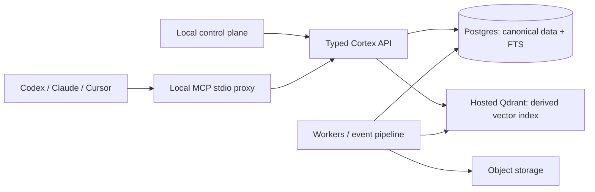

# Cortex architecture context

**Status:** Product direction and hackathon boundary, not a deployment record.

Cortex is an evidence-first company-context service. Its primary consumers are
existing agents—Codex, Claude, and Cursor—through an MCP boundary. The local
hackathon UI is a companion control plane for requesting bounded context,
inspecting cited evidence, and checking local health; it is not a general chat
product or a second retrieval implementation.

## Intended durable architecture



Postgres is canonical. Qdrant holds rebuildable, filtered vector-index state;
it must not receive raw provider payloads, source text, signed URLs, or
secrets. The API, not browser or MCP-tool arguments, derives workspace and
authorization scope. Hosted Qdrant is the intended durable environment target;
the packet does **not** demonstrate a hosted Qdrant deployment, live index, or
production retrieval quality.

The accepted implementation plan is
[Durable Retrieval and Local Control-Plane Plan](../specs/2026-07-19-durable-retrieval-local-control-plane.md).
It calls for a shared API/runtime so the UI and MCP proxy consume the same cited
evidence path.

## What this packet actually demonstrates

The hackathon walkthrough uses a deterministic local fixture corpus:

- 10 synthetic source records across Slack, Google Drive, Linear, GitHub, Jira,
  and repository-doc source shapes;
- three media-source files with two caption and one transcript derivatives;
- local seed → pipeline → ranked fixture evidence → context-gate rehearsal;
- a local stdio MCP smoke that creates an opt-in portable handoff bundle.

The handoff always reports `session_accessed: false`. Cortex neither reads,
resumes, nor forks a native Claude session in this demo.

## Explicit non-claims

This packet does not prove live provider authentication, OAuth, realtime sync,
customer data isolation, production permission enforcement, hosted deployment,
or a production Qdrant index. Provider names identify fixture shapes only.
Use the evidence disclosure and rehearsal output as the source of truth for the
demo claim boundary.

```bash
uv run python scripts/hackathon_demo_rehearsal.py --format human
uv run python scripts/hackathon_evidence_report.py
uv run python scripts/mcp_protocol_smoke.py
```
