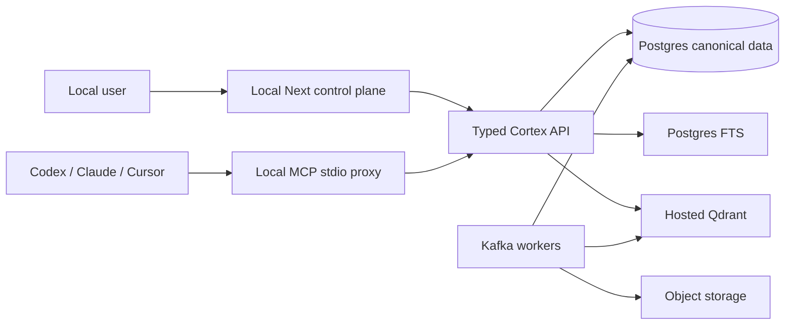

# Durable Retrieval and Local Control-Plane Plan

**Status:** Accepted planning baseline
**Date:** 2026-07-19
**Scope:** Cortex's next two delivery tracks: hosted Qdrant-backed durable retrieval and a local-only product control plane.

## Decisions captured

| Decision | Chosen direction | Why |
| --- | --- | --- |
| Vector store | Hosted Qdrant in durable environments; persistent local Qdrant only for development/integration tests | Keeps the vector index operationally simple while preserving the existing rebuildable-index boundary. |
| Canonical data | Postgres remains authoritative; Qdrant is derived and content-free | Enables deletion, audit, ACL enforcement, and complete rebuilds. |
| Product UI | Local-only Next.js app for the hackathon | Lets the team polish a real workflow without prematurely solving hosted auth/deployment. |
| UX model | Linear-inspired workspace control plane, not a Cortex chat app | Cortex reduces agent setup friction; the primary consumer remains Codex/Claude/Cursor through MCP. |
| First UI proof | Context request -> cited evidence -> source/trace -> health/backfill | Demonstrates useful retrieved context and honest operational evidence in one flow. |

## Product boundary

The UI is a companion control plane. It helps a person connect sources, see what was ingested, inspect evidence, and copy a bounded context payload into an existing agent. It does **not** become a general chat surface, a direct Qdrant client, or a second retrieval implementation.



No browser code accesses Qdrant, Kafka, object storage, or Postgres. Qdrant is searched with server-side workspace/status/version filters; text and citations are hydrated only from Postgres after permission checks.

## Current state to preserve and close

### Reuse

- Canonical raw-event, source-object, file, chunk, embedding, and index-job models/migrations.
- Kafka event vocabulary, source-aware chunker, embedding-version discipline, Qdrant lifecycle deletion seam, and existing hybrid-candidate/evidence DTOs.
- Existing Next 15/React 19/Tailwind/Radix/cmdk scaffold in the user-owned `of/frontend-scaffold` worktree, including its dark design tokens, app shell, evidence components, and primitive library.

### Do not mistake for finished

- `embedding.completed`, `index.requested`, and `index.completed` are not dispatched into a persistent index pipeline today.
- SQL FTS currently falls back to Python substring matching; the Qdrant vector interface is only in-memory in the retrieval path.
- The dirty Next scaffold is visual/static: it has no real browser API/session/query/job data flow.
- FastAPI already serves legacy `/ui/*`; the Next scaffold also uses `/ui/*`. Route ownership must be changed before a live UI is extended.

## Track A — hosted Qdrant, durable indexing, and real hybrid retrieval

### A1. Configuration and index contract

1. Add a production `QdrantVectorIndex` adapter behind the existing `VectorIndex` protocol. It owns collection bootstrap, health, filtered search, upsert, delete, and no-op/idempotency behavior.
2. Configure the hosted Qdrant URL and API key only in server/worker configuration and secret storage. Never expose either to the browser or MCP tool arguments.
3. Use one collection per **environment + embedding model/version + dimensions**, rather than one collection per workspace. Every point carries `workspace_id`, source/chunk identifiers, lifecycle status, provider, model/chunk/index version, and a compact ACL/scope revision as filterable payload.
4. Keep source text, raw provider payloads, signed URLs, extracted bytes, and secrets out of Qdrant payloads. Deterministically derive the point ID from the durable embedding record/chunk version.
5. Retain a persistent Docker Qdrant volume for local development and Compose-backed integration tests. Hosted Qdrant is the durable deployment target.

### A2. Idempotent index pipeline

1. Finish the lifecycle: `source_chunk.upserted -> embedding.requested -> embedding.completed -> index.requested -> qdrant.indexed -> index.completed`.
2. Write an index job/outbox record in the same Postgres transaction as the state change. A dispatcher publishes/retries it; a worker makes vector delivery idempotent by point ID plus content/model/version hash.
3. On update, upsert the current point and make old-version/deleted chunks ineligible immediately. On deletion/revocation, delete or tombstone the vector point and invalidate evidence/cache projections.
4. Reconcile outbox, embedding records, index jobs, and Qdrant on a schedule. Rebuild must be possible solely from Postgres canonical chunks plus embedding records.
5. Record `lexical_ready`, `vector_ready`, `hybrid_ready`, `partial`, and `failed` per source/chunk/version. Never claim hybrid completeness if either required target is stale or unavailable.

### A3. Retrieval path

1. Replace Python substring matching with real PostgreSQL FTS/`tsvector` ranking under workspace, provider, source, status, version, and scope filters.
2. Embed the query once, run FTS and Qdrant searches concurrently, then fuse calibrated candidates under the existing candidate contract. Preserve raw lexical/vector score provenance.
3. Push workspace/status/version/provider/scope filters into both databases. Derive authority from the authenticated tenant context, never a caller-supplied workspace ID.
4. Hydrate text/citations from Postgres only, then apply the permission check again before evidence rendering. Missing or stale authorization data fails closed in the durable profile.
5. Make partial-path behavior explicit: FTS-only or vector-only may return a labeled partial result when policy allows; a total retrieval failure returns a stable error and trace ID.

### A4. Proof and operations

- Compose integration: Postgres + persistent local Qdrant + worker proves one canonical chunk becomes exactly one searchable point, survives a restart, and is deleted after revocation.
- Golden evaluation: exact issue/PR/SHA/file queries, paraphrases, cross-source context, media-derived text, no-result, stale, ACL denial, FTS-only, vector-only, and outage cases.
- Metrics: queue age, outbox lag, index latency, index error/retry count, FTS/vector candidate counts, hybrid-ready coverage, stale-point count, rebuild duration, and per-query partial status.
- Runtime readiness must surface Qdrant connectivity/collection/schema status without exposing credentials or source content.

## Track B — local Linear-inspired product control plane

### B1. Route and session boundary

Use a product namespace owned exclusively by Next:

```text
Next product:       /ui/...
Next local BFF:     /api/cortex/...
FastAPI JSON:       /dev/..., /demo/..., /health/..., then /api/v1/...
Legacy FastAPI HTML: backend /ui/... — frozen, never proxied into the product
```

The local Next server and FastAPI server run on different loopback ports, so the
Next product owns the user-facing `/ui/*` namespace now. Before a single-host
deployment, CTX-108 must retire or move the legacy FastAPI HTML surface to
`/ops/*`; it must never be proxied into the product. The local session/workspace
resolves server-side; route/body values are not tenant authority. The BFF only
allows an explicit set of backend paths/methods and never forwards arbitrary
browser identity headers or cookies. There is no direct CORS/browser-to-data-store path.

### B2. Information architecture and order

| Route | Job to be done | First-release content |
| --- | --- | --- |
| `/ui/context` | Request a bounded context bundle | prepared COR-123 fixture request first; result/citation pane, coverage/freshness/partial state, copy-to-agent action. |
| `/ui/evidence/[id]` | Verify why a result was returned | claims, stable citations, source/time/version provenance, trace and permission-safe explanations. |
| `/ui/runs/[id]` | Prove the fixture pipeline flow | seed-to-gate stage timeline, artifact summaries, and explicit fixture-only labels. |
| `/ui/health` | Resolve stale/failed work | local API/runtime readiness now; indexed-vs-expected/source health once durable. |
| `/ui/setup/mcp` | Give an agent access | MCP configuration, tool inventory, and a local connection check. |
| `/ui/evidence`, `/ui/sources`, `/ui/connectors`, `/ui/traces/[id]` | Future operational control plane | capability-gated shells until durable list/detail/control APIs exist. |

The root redirects to Context. Implement Context -> Evidence -> Pipeline Run -> MCP Setup first, then Health. Sources/connector/traces are capability-gated until their durable APIs exist. Settings/team/billing, full audit administration, and a general chat are explicitly deferred.

### B3. Interaction and visual rules

- Borrow Linear's information density and interaction qualities, not its branding: quiet hierarchy, narrow persistent sidebar, high-signal lists, a detail pane, keyboard-first command palette, predictable shortcuts, and small status language.
- The center of gravity is a cited bundle, not a streaming conversation. Show query intent, source filters, freshness, coverage, evidence confidence/provenance, and a copyable MCP-friendly handoff. A context request is an auditable record, not a chat message.
- Default to compact tables/timelines for sources and jobs. Use drawers/detail panels rather than navigation churn. Keep a full mobile navigation replacement; do not simply hide the desktop sidebar.
- Every page has loading, empty, no-result, partial, stale, denied, and error states. Static fixture content must be visibly labeled until the real API contract is wired.
- Evidence views never expose raw provider payloads, token values, Qdrant payloads, or restricted-content counts that reveal protected information.

### B4. API contract before screen wiring

Use the existing fixture/dev routes only through a fixture adapter in the first local slice: fixture seed/reset, pipeline run/read, retrieval query, evidence-pack read, demo disclosure, and readiness. Add `GET /dev/state` to make seeded state, fixture counts, latest run, latest gate, and `live_data: false` explicit.

Create typed Pydantic/FastAPI and TypeScript schemas for the durable profile:

1. local session/workspace/capabilities and trace IDs;
2. context query and cited evidence-pack response;
3. evidence/trace and source-object summaries;
4. source, sync, connector, index, and health lists;
5. job actions/status with idempotency key, audit ID, retry guidance, and stable errors.

Use server components for initial reads and small client islands for the composer, filters, polling, command palette, clipboard, and panels. Poll operational status initially; add SSE only after a durable readiness projection exists. Mutations require the local-session guard, CSRF/idempotency/audit plumbing, and permission checks even in the local profile. The fixture mode visibly disables free-form retrieval and provider filters because the current deterministic retriever does not honor them.

### B5. Scaffold preservation and implementation boundary

The frontend is currently user-owned and dirty in a different worktree. Before implementation, the owner must checkpoint it to a dedicated branch/commit or explicitly authorize a safe copy into a new UI worktree. Do not overwrite it from the clean backend/integration branch. Reuse its tokens and primitives after removing duplicate component exports and resolving dead links; do not treat its static UI claims as production behavior.

## Delivery sequence and existing ticket map

| Slice | Existing tickets to activate/refine | Exit proof |
| --- | --- | --- |
| Runtime foundation | CTX-011–020, CTX-101–103 | one composition root, stable config, typed API/error envelope, outbox replay. |
| Durable hybrid index | CTX-004, CTX-061–067, CTX-084, CTX-088–089, CTX-107 | persistent Qdrant point/search/delete + true FTS + readiness/ACL/rebuild tests. |
| Retrieval/evidence API | CTX-068–074, CTX-082 | authenticated request returns stable cited evidence and trace; MCP and UI use the same service. |
| Local UI foundation | CTX-093, CTX-108 plus new UI sub-tickets | route ownership settled, local proxy/session, typed feature folders, no dead navigation. |
| Context vertical slice | CTX-094–096 | real query -> evidence -> source/trace with honest states. |
| Operational proof surfaces | CTX-018, CTX-092, CTX-097–100 | sources/health/connectors show real ingestion/index counts and recoverable failure. |

## Definition of done

The tracks are complete enough to claim a polished hackathon proof only when:

1. A real canonical chunk is emitted, indexed in hosted/local-test Qdrant, found through an authenticated hybrid query, and rendered with a stable citation.
2. A Qdrant failure/restart, stale index, deletion/revocation, removed source scope, and cross-workspace attempt are tested and have truthful user-visible outcomes.
3. The local UI exercises the same API used by the MCP proxy; it does not contain a separate fixture-only retrieval implementation.
4. The UI can visibly prove ingestion/event/object/chunk/index counts, per-source freshness, media extraction provenance when present, and partial/failure conditions.
5. Frontend lint, type-check, build, and deterministic end-to-end smoke tests pass alongside Postgres/Qdrant integration tests.

## Deferred decisions

- Exact hosted Qdrant project/region/cost tier and production secret provider.
- Multi-user hosted UI auth, SSO, billing, and deployment topology.
- Whether to add real-time SSE after polling has proven sufficient.
- Reranker/model choice and a move from calibrated weighted fusion to RRF, if evaluation results justify it.
- Broader OAuth connector rollout beyond the first hackathon proof sources.
