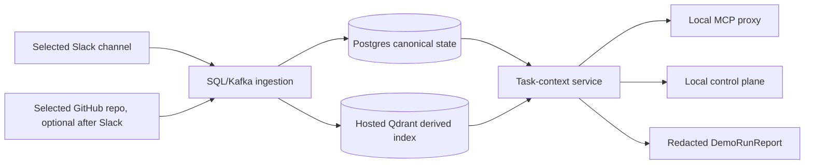
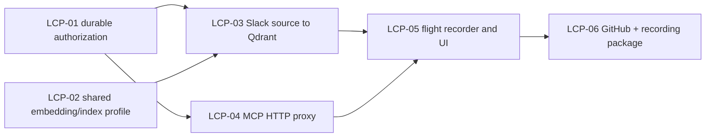

# Live Context Proof Slice

**Status:** Proposed
**Date:** 2026-07-20
**Owner:** Cortex engineering
**Target:** A credible, controlled hackathon proof that an existing agent can ask Cortex for live company context and receive cited evidence.

## Problem

Cortex now has strong independent foundations: Slack/GitHub connector paths,
the canonical SQL/Kafka pipeline, a hosted-Qdrant adapter, the evidence-first
`get_task_context` contract, an MCP stdio server, and a local control-plane
shell. The product claim is still not demonstrable end to end.

The durable runtime deliberately fails closed today because it has no
SQL-backed permission-scope factory. In addition, document indexing and query
retrieval can select different Qdrant collections and embedding providers, and
the stdio MCP entry point has no authenticated API-backed transport. The
current hackathon packet is therefore correctly fixture-only.

## Outcome

Prove this bounded flow with a user-controlled workspace:



The proof is not a new chat product. An engineer continues working in Claude
Code, Codex, or Cursor; Cortex supplies an MCP `get_task_context` response
with citations, freshness, retrieval status, and a trace ID.

## Success criteria

1. A selected Slack channel can be backfilled into canonical SQL state and
   become a searchable Qdrant point through the normal worker path.
2. An authenticated `POST /v1/context/task-context` returns `live_data: true`
   with cited Slack evidence, a trace ID, source coverage, and freshness.
3. The local stdio MCP proxy returns the same task-context/evidence contract
   as REST without accepting workspace or actor authority from tool input.
4. A redacted `DemoRunReport` proves exact per-source event, object, chunk,
   embedding, index-job, vector, and query/evidence counts; it distinguishes
   `live`, `imported_snapshot`, and `fixture` data modes.
5. The control plane shows the same cited context and report, not a parallel
   fixture retriever.
6. Cross-workspace access, missing scope, stale/removed scope, Qdrant outage,
   and API/worker restart all fail safely and visibly.

## Explicit scope

### Must ship

- One approved Slack channel, SQL/Kafka, hosted Qdrant, the task-context API,
  and the local MCP proxy.
- Durable authorization composition using persisted permission scopes. Provider
  ACL snapshots remain fail-closed where enabled.
- One shared embedding/index profile used by document and query embedding,
  collection naming, dimensions, and model/version metadata.
- Read-only status/report APIs plus the existing Context, Evidence, and Health
  screens wired to them.
- One reproducible operator command that preflights, runs the golden query,
  writes a redacted report, and exits nonzero on a failed gate.

### Should ship after Slack is green

- One selected GitHub repository, persisted source binding, controlled
  backfill, and a cross-source golden query. It is a demo expansion, not a
  prerequisite for landing the Slack proof.
- Read-only Google Drive/Jira **snapshot** rows in the report, clearly labelled
  as imported snapshots. They are not live OAuth connectors in this slice.

### Deliberately out of scope

- Live Drive, Jira, Confluence, or broader Atlassian OAuth/change sync.
- Native Claude/Codex session access, resume, or fork.
- General chat, multi-user hosted UI auth, SSO, billing, or full connector
  administration.
- Live media download/OCR/transcription, object-storage migration, and broad
  source-lifecycle redesign.
- A claim of production readiness beyond the controlled demo workspace.

## Repository facts driving the plan

| Fact | Consequence |
| --- | --- |
| `create_app()` only installs `DurableContextRetrieval` when an injected durable permission factory exists. | Normal SQL + Qdrant startup must keep returning a transparent 503 until scope persistence and composition exist. |
| Permission scopes have an in-memory repository only; provider ACL snapshots already have SQL records. | Add a small SQL permission-scope repository and build a per-request safe authorization snapshot rather than bypassing scopes. |
| Indexing currently uses a fixture collection name while durable query retrieval derives one from settings. | Introduce one shared `EmbeddingIndexProfile`; no production path may hard-code a fixture collection. |
| Real document embeddings can use Gemini while durable queries currently use deterministic embeddings. | Use the same provider/model/version/dimensions for document and query embeddings; preserve deterministic mode only for explicit local fixture/testing profiles. |
| `cortex-mcp` starts with no durable host authority. | Add a narrow local stdio-to-HTTP proxy for `get_task_context`; it binds identity in trusted local configuration, not MCP arguments. |
| Slack is the strongest durable connector; GitHub source selection is not restart-safe yet. | Slack is the first live source. GitHub joins only after durable source binding/credential setup is proven. |

## Work packages

### LCP-01 — Durable authorization snapshot (days 1–2)

**Reuse:** `PermissionScope`, `PermissionService`, SQL provider-ACL records,
tenant context, and existing source-selection paths.

- Add `permission_scopes` persistence and a SQL repository with conflict-safe
  active/remove operations.
- Load scopes for the trusted workspace before retrieval and construct a
  request-bounded `PermissionService` snapshot. Do not permit caller source IDs
  to grant access; they only narrow already-authorized candidates.
- Resolve caller provider principals from the existing mapping repository when
  provider ACL enforcement is enabled. Missing/stale snapshots remain denied.
- Inject the factory from the durable app composition root only in SQL + Qdrant
  profiles. Preserve `CONTEXT_RUNTIME_UNAVAILABLE` when configuration is absent.

**Acceptance:** SQL restart preserves scopes; a removed channel/repository is
not retrievable; cross-workspace and source-ID probing attempts are denied.

### LCP-02 — One embedding and index profile (days 1–2, parallel)

**Reuse:** `Settings`, retrieval YAML, embedding providers, Qdrant adapter,
and index worker.

- Create `EmbeddingIndexProfile` that yields provider, model, version,
  dimensions, document/query task type, and settings-derived collection name.
- Pass the profile into the embedding worker, index worker, and durable
  retrieval; remove hard-coded `fixture-cortex-dev` outside test fixtures.
- Assert Qdrant schema/collection readiness before accepting a durable profile.
- Add migration-safe/index-safe behavior for a changed model/version:
  separate collection or explicit reindex, never mixed vectors.

**Acceptance:** a document vector and query vector have compatible shape/model
metadata, land in the same collection, and a semantic query can retrieve its
canonical SQL citation.

### LCP-03 — Controlled live Slack path (days 3–4)

**Reuse:** Slack OAuth, selected-channel validation, backfill, webhook,
`SessionRawEventIngestionService`, Kafka dispatcher, and Qdrant index worker.

- Add an operator-only live-source preflight that validates configuration,
  migration revision, selected scope, worker readiness, and Qdrant health
  without printing credentials or source bodies.
- Backfill one approved Slack channel through the normal pipeline and wait for
  terminal per-stage statuses.
- Repair the known async source-selection smoke path and add a Compose-backed
  integration harness: event → source object → chunk → embedding → index job →
  verified point → cited task context.
- Prove idempotent re-run and API/worker restart recovery.

**Acceptance:** an approved Slack message is cited by both REST and MCP, and
the same event is not double-counted after a repeated backfill.

### LCP-04 — API-backed local MCP proxy (days 3–4, parallel)

**Reuse:** existing stdio JSON-RPC protocol, strict task-context schema, and
the API endpoint.

- Add a local configuration object for API base URL and short-lived/local demo
  credential; keep secrets out of stdout, source control, and MCP arguments.
- Implement only `get_task_context` in the proxy path initially. It forwards
  request data and trusted auth headers, validates timeouts/errors, and returns
  the server's cited response unchanged except for transport diagnostics.
- Keep native session access/resume/fork unsupported.

**Acceptance:** a recorded MCP JSON-RPC exchange and REST request for the same
task share workspace, trace/evidence semantics, and source coverage.

### LCP-05 — Demo flight recorder and source-health contract (days 5–6)

**Reuse:** raw-event/source/chunk/embedding/index-job repositories, Qdrant
readiness, evidence packs, and existing Health/Context UI shells.

Add a read-only report with only safe aggregate fields:

```text
DemoRunReport
  run_id, started_at, finished_at, mode
  source[{provider, source_id_hash, mode, last_sync, events, objects, chunks,
          embeddings, index_jobs, vectors, readiness, error_code?}]
  qdrant[{collection, schema_ready, expected_points, observed_points}]
  queries[{trace_id, evidence_pack_id, provider_coverage, retrieval_status}]
  totals, warnings
```

- Store report/trace records durably enough to regenerate screenshots and
  review a run after restart; never include raw text, external URLs, provider
  tokens, or protected-content counts.
- Add `GET` endpoints for source health and the report. The browser BFF
  allowlists only these read paths.
- Replace raw evidence JSON with a compact citation/provenance view and show
  data mode, freshness, partial state, and report counts.

**Acceptance:** judges can see exact "ingested/indexed/queried" evidence with
an explicit mode label, and one evidence card deep-links to its cited record.

#### Implementation boundary — 2026-07-20

The credential-free slice now contains a durable, immutable
`demo_run_reports` SQL projection and a read-only workspace-scoped reader. It
stores only a validated `live-context-run-report/v1` JSON snapshot plus opaque
hashes, aggregate metadata, and Cortex's internal source-connection ID. It
does not expose a browser/MCP write route, call a provider/Qdrant while reading,
or fall back to a previous report if the newest snapshot is malformed.

That is intentionally **not yet an automatic exact-count ledger**. Current
canonical rows do not all carry a common controlled-run identity, so deriving a
report from workspace-wide counts would be misleading. The follow-up finalizer
must create one durable run ID, record idempotent membership across raw event →
object → chunk → embedding → verified vector → retrieval/evidence, and only
then write this projection. Hosted Slack/Qdrant credentials are required for
that acceptance run, not for the projection or its tests.

### LCP-06 — GitHub second-source and packaged proof (days 6–9)

Only start after LCP-01 through LCP-05 are green.

- Persist the selected GitHub repository binding and its workspace-scoped
  credential/installation reference; fail closed on restart or missing binding.
- Backfill one repository and add a cross-source task (Slack decision ↔ GitHub
  PR/issue) to the golden evaluation set.
- Update the local UI, README, run-of-show, screenshots, slides, and video
  **from the report and captured application screens**. Keep a deterministic
  fixture fallback and disclose the source mode shown in every artifact.

**Acceptance:** a second provider appears in the same report/evidence pack,
and all public demo claims can be regenerated from the saved run report.

## Delivery order and dependency graph



The first demo checkpoint is after **LCP-05**, using a real Slack source. The
GitHub/cross-source story is a second checkpoint, not a reason to delay the
first credible MCP demonstration.

## Test and demo gates

### Automated

- SQL migration upgrade/downgrade and repository tests for active/removed
  permission scopes.
- Compose integration test covering Slack-shaped input, Kafka, Postgres,
  Qdrant point verification, REST task context, and stdio MCP proxy.
- Regression matrix: workspace isolation, missing scope, revoked scope,
  stale ACL, caller-supplied source ID, Qdrant outage (labelled partial/error),
  duplicate backfill, and restart recovery.
- Profile parity test: the pipeline and retrieval use the same collection,
  provider/model/version, dimensions, and payload allowlist.
- Frontend lint/typecheck/build plus a browser or route-level golden test that
  verifies the Context and Health pages render API-provided data, not fixtures.

### Operator gate before recording

1. Run one no-secret preflight.
2. Run selected-source backfill and wait for index readiness.
3. Execute the golden REST and MCP queries.
4. Save the redacted `DemoRunReport` and verify displayed counts against it.
5. Capture the Context, Evidence, and Health frames; update deck/video only
   from those artifacts.
6. Keep the fixture recording path ready as a clearly-labelled fallback.

## Risks and mitigation

| Risk | Mitigation |
| --- | --- |
| Credentials or private content appear in a demo artifact. | Report hashes/counts/statuses only; credentialed steps are operator-run; capture review is a required gate. |
| Hosted Qdrant is unavailable or collection schema drifts. | Preflight schema health; label retrieval partial/unavailable; keep deterministic fixture fallback. |
| Scope/ACL wiring leaks data. | Fail closed by default; trusted tenant authority only; test removal, stale ACL, source-ID probing, and workspace isolation. |
| GitHub expands the critical path. | Do not begin it until the Slack acceptance suite passes; demo remains credible with Slack plus clearly-labelled snapshots. |
| UI polish delays the proof. | Wire only Context, Evidence, and Health to real contracts; defer dashboard breadth and visual overhaul. |

## Deferred follow-ons

1. Live Drive and Atlassian connectors through the same selected-source,
   scope, ingestion, and report contracts.
2. Object storage and media extraction so images/video are live rather than
   fixture-derived.
3. Full durable outbox/retry/reconciliation and broad source lifecycle work.
4. Hosted multi-user auth and a polished connector-admin UI.
